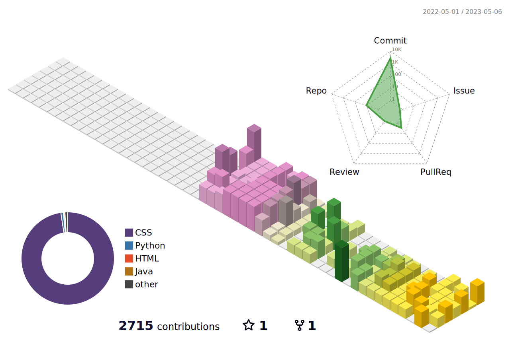

<h2>Why is a day only 24 hours?</h2>

안녕하세요 웹과 앱에 관심이 많은 대학생 김광일이라고 합니다!

 

<h4>👨‍👨‍👦‍👦 TEAM 👨‍👨‍👦‍👦</h4>
<li>
<b>CRA</b> - <a href = "https://cra16.github.io" style = "color : rgb(76, 161, 195)"> Computer Research Association</a> ( 2020.04.05 ~ )
</li>
<li>
<b>비타500</b> - <a href = "https://www.notion.so/500-ac808876526a4b4c97376b77aa3d11e1?pvs=4" style = "color : rgb(76, 161, 195)"> 2023 비즈플로우 Team </a> ( 2023.03.21 ~ 2023.07.XX)
</li>
 
    
<h4>🚗 Timeline 🚗</h4>
<u>
    <li>2014.02.05 승지초등학교 졸업 🎓</li>
    <li>2017.02.04 시흥능곡중학교 졸업 🎓</li>
    <li>2020.02.03 경기자동차과학고등학교 졸업 🎓</li>
    <li>2020.03.02 한동대학교 입학 🏫</li>
    <li>2021.04.27 군입대 🫡</li>
    <li>2022.10.27 병장 만기 전역 🪖</li>
    <li>2023.02.27 군복학 🏫</li>
</u>
 
 

<!--  -->
<!--  -->

<table border = "1 solid" bordercolor = "skyblue" align = "left">
    <tr>
        <td>
            
        </td>
        <td>
            
        </td>
    </tr>
</table>

